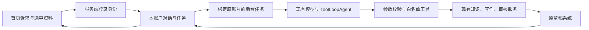

# 小掌柜 U04：账户对话、记忆与工具执行本地验收

日期：2026-10-10。状态：本地实现与验证，待用户验收，未提交或发布。

## 范围和所有权

- 分支：`feat/xiaozhanggui-agent-runtime`，基线 `main@28ef6d3`。
- 工作区：`/Users/renxiaokang/connor/berich/内容工厂/.worktrees/xiaozhanggui-agent-runtime`。
- 本批拥有 `src/modules/agent/chat/**`、三个聊天 API、聊天/知识选择组件、`agent-command-bar.tsx`、相关测试、SDK 依赖和本批文档。
- U03 的 `feat/xiaozhanggui-home-tasks` 尚有未提交改动，本批未修改其代码或数据。整合时先保留 U03 首页与计划逻辑，再使用 U04 对话组件；保留 `AgentCommandBar` 现有参数契约。共同修改的升级文档、package.json 和 mock 网关需合并两批内容后复验。
- 主仓库应用代码、生产客户个人空间、生产配置和已发布数据库结构均未修改。

## 已实现的路径



完整对话保存于新增 `agent-chat.local.json`，复用私有空间 JSON 存储。缺失存储 GET 返回空状态；不会迁移、回填或自动修改已有资料。模型使用最近 16 条消息、明确记忆、本对话已保存的草稿引用及相关知识元数据；本次用户诉求最多 4000 字，完整送入上下文。历史全文可检索。

首次开放工具：读取经营资料、查找历史内容、读取草稿、检索知识、读取知识、搜索历史对话、加载写作/知识方法、创建并审核一篇草稿、等待用户补充。内置方法只是可信指令，动作调用现有业务服务；不执行任意脚本。

用户显式保存/编辑/删除最多 30 条记忆，每条最多 500 字，保存来源消息与修改时间。记忆用于上下文和表达偏好，正式经营事实、定位与风格不由聊天自动覆盖。长期风格仍用原账号档案，临时要求随本篇项目保存。

本地选择最多两份索引文件，每份取前 12000 字，界面提前说明会送给模型并随账号聊天保存。已提交片段可继续使用；原始文件及未选择的目录内容不会自动上传。跨设备可读取聊天片段，不能读取原电脑的未提交文件。

## 恢复、去重与任务状态

- 请求 ID 在账户内去重；同一 ID 不同内容返回冲突。每个账户同一时间最多一个活动对话任务，不影响其他账户。
- 稳定任务 ID 和草稿 ID；模型同一步的多个工具调用串行执行，重复创作返回已有结果。已保存正文不再次覆盖。
- 创作参数、已完成工具、结果引用和首次使用资料快照保留；重试从业务检查点接续。
- 页面关闭不取消后台任务，后台始终使用创建时的个人空间。对话记录和状态跨服务器重启保留。
- 显示真实阶段、工具状态及草稿链接；区分等待补充、完成、失败、中断、暂停。步骤耗尽、模型截断和工具失败不能显示完成。
- 每次最多 6 轮模型调用、12 个不同工具记录；模型每轮输出最多 1800 tokens，代理总超时 240 秒、单轮 65 秒，写作业务沿用原有调用限时。
- 每轮首个模型步骤要求真实工具调用，模型/网关没有成功执行工具时不能显示完成。普通讨论也会先查询上下文；单轮额外增加一次模型往返。要求最新状态时重新读取，历史结果不当作本轮读取证据。
- 暂停阻止后续调用和保存；已经发出的模型请求可能继续到返回。已完成结果仍保留，不承诺立即中止全部外部计算。
- 后台为一个业务步骤内的模型循环，并非逐条持久化模型事件的完整重放引擎。生产部署中长运行崩溃恢复仍需部署后的专用验收。

## 验证记录

自动验证命令：

```sh
npm run build
npm run lint
node --test src/tests/agent-chat.test.mjs src/tests/account-isolation.test.mjs
node --test src/tests/production-guardrails.test.mjs src/tests/first-content-start.test.mjs src/tests/publication-delivery.test.mjs src/tests/persistence-restart.test.mjs
```

本批 46 项相关测试通过：对话 11 项、账户隔离 15 项，以及生产保护/首篇/交付/重启 20 项。最后应用修改后重新构建和执行对话/隔离 26 项，全部通过。

相关隔离测试覆盖：空读取不建记录、未登录拒绝、参数边界、完整长诉求、重复请求、并行模型调用只生成一次、前后两轮按真实 ID 读取同一草稿与先前知识、显式记忆修改/删除、缺资料等待、猜 ID 拒绝、步骤/输出长度上限、网关失败重试、保存草稿后失败续跑、暂停后继续、服务器重启及旧内容入口。旧稿的人工审核和发布登记/指标读取另有用例，读取前后原始业务文件完全一致。模拟网关检查首轮 required 协议，并模拟忽略工具约束，后者必须显示失败，不能以文本冒充执行完成。

两个人工账户使用相同请求 ID 和资料 ID，同时后台读取各自素材；完整对话、知识、记忆和结果仍各自私有。服务端忽略伪造个人空间请求头，猜另一账号的对话、任务或消息 ID 返回 404；后台所有者不会随浏览器切换账号改变。

旧版本隔离资料访问时阻断并统计云写入，首页、聊天和旧资料页面访问没有写入尝试；原始内容、版本、时间戳、未知字段、账号归属完全不变。所有写测试为临时本地目录和模拟云服务，未对生产客户空间执行保存。

构建和 Lint 通过；Lint 仅保留原有 market 两处未使用变量警告，构建仍有原有 middleware 弃用提示。首次测试修正了验收脚本错误的返回字段，以及把模型调用日志误当作经营数据变更的断言；未放宽旧数据只读验证。

## 真实模型和浏览器

沿用现有 AI_BASE_URL/AI_API_KEY/AI_MODEL，只读取模型配置，不复制生产登录、数据库或客户资料。模型为 Deepseek-v4-flash；原生 function tool_calls 探针成功。

在全新隔离花店资料中，真实模型选择读取经营资料、读取选中的花束知识、加载写作方法、创建/审核草稿，四轮完成任务。保存标题为“到店挑花，说清用途和色系，再制作花束”，正文 150 字，附三条实拍建议；引用回到提供的资料，审核低风险且有一条表达建议。没有人工确认或发布，单一样本不代表所有写作质量通过。

首次真实续聊发现关键词无命中时模型误报没有草稿，并误称没有本地文件。已补充本对话真实草稿 ID/引用和先前文件元数据，搜索覆盖最终标题与多个关键词；新回归用例要求下一轮按真实 ID 读回草稿及原文件，不产生新稿。

真实续聊复验已按同一 ID 读回正文与先前知识，未增加草稿。另发现模型自行补上 example.com 域名，已要求使用工具相对路径，并将已核实草稿 ID 的绝对链接规范为站内路径，增加回归断言。新对话查找最近草稿也能读取真实正文，当前隔离实例仍仅一篇稿件。

草稿读取改为包含人工审核与发布记录；真实模型复验确认待人工核对、暂无发布登记，并说明不能据此判断外部平台是否发布。先前回答中的实现字段已增加自然中文表达约束，不改写历史消息。

连续核对曾出现模型没有调用本轮工具却声称“又读了一遍”。只加提示词的复验仍重现，因此首轮改用必需工具调用协议，并检查本轮真实成功记录；旧消息保留作为验收证据，不自动改写。

最终使用相同诉求在同一对话复验，本轮真实调用 read_content，回答用自然中文说明待人工核对与暂无登记，未生成新稿。真实网关支持 required 协议。模拟忽略工具的用例首次因预期具体错误文案失败：SDK 先拒绝不符合协议的结果，界面显示通用可重试错误；用例改为验证失败状态、零成功工具和没有保存助手完成消息，不依赖是哪层先拒绝。

浏览器任务空间 11，使用隔离实例。原生点击完成记忆确认保存，刷新后保留；通过输入框提交续聊，真实阶段、工具记录及站内草稿入口可用，点击进入原草稿页面。390×844 手机模式原生发送续聊成功，页面 scrollWidth 与 innerWidth 均为 390，聊天区域宽 358、输入框宽 324，没有横向溢出。此为 Chromium 视口模拟，未等同于真实手机和本地文件夹授权验收。

截图已目视检查：

- [桌面对话](artifacts/agent-chat-desktop-2026-10-10.png)
- [站内草稿](artifacts/agent-draft-desktop-2026-10-10.png)
- [手机对话](artifacts/agent-chat-mobile-2026-10-10.png)

本机预览：`http://127.0.0.1:4583/`。Basic 用户名 `contentfactory`、访问码 `agent-local`。数据位于 `/var/folders/vz/cx0krm0x2b9d_8dy3qf459tw0000gn/T/contentfactory-agent-preview-9Mt0ZE`，只包含本次虚构验收资料。临时启动器 `/tmp/contentfactory-u04-preview.mjs` 保留该目录，启动前复制 standalone 静态资源，不改变生产启动逻辑。

## 用户验收与下一步

1. 在首页接着已有对话说“读一下刚才那篇，告诉我用了哪些资料”；确认返回同一稿件，不生成新稿。
2. 新对话提出自己的写作主题和明确渠道，选一两份资料；检查执行记录、最终草稿、引用、审核和实拍清单。
3. 保存一条表达偏好，刷新并续聊；再编辑/删除，确认原业务与长期风格不自动改变。
4. 浏览器首次连接/恢复本地文件夹权限由用户本人处理，检查选择两份、缺权限提示、截取说明及跨设备资料边界。此项没有以模拟 API 代替真实目录授权验收。
5. 可暂停任务后继续；保留完成结果，生成不等于发布。

下一工作包 U05：把现有平台查询和用户导入包成受限调研工具，接入调研方法与来源/时间/缺口记录，再把结果转成选题。附近地点、点评权限、实时爆款各项单独验证。聊天旧稿编辑、正式定位/风格确认、文件夹自动整理、自动发布及平台效果抓取尚未开放。

本次未提交、推送、创建 PR、合并或发布；生产环境验证和用户试用结果待填写。
