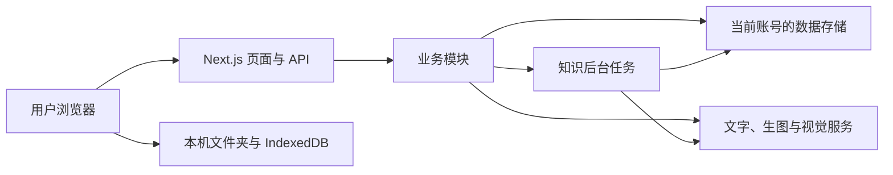

# 内容工厂当前架构

更新日期：2026-10-10（Asia/Shanghai）。整合快照：发布分支 `d143355`，包含 U03 日期计划、U04 账户对话、U05 Brave / RedFox / 高德与恢复限制；237 项检查通过。发布前生产基线为 `main@28ef6d3`，本次发布记录见 [整合验收](acceptance/Xiaozhanggui-U03-U05-Release-2026-10-10.md)。

本页说明已实现的结构和模块边界，供新会话快速恢复上下文。最新完成状态与下一步见 [progress.md](progress.md)，开发与发布约束始终遵守 [AGENTS.md](../AGENTS.md)。详细规格和路线文档保留其编写时的快照，不能把其中的目标直接当作现有能力。

## 1. 产品与运行结构

内容工厂服务不同业务的用户，围绕真实经营资料完成选题、创作、审核、人工发布与反馈。“小掌柜 AI”是本轮运营助手方向的暂用名称，界面正式改名尚未完成。

- Web：Next.js App Router、React、TypeScript、Tailwind CSS；版本以 [package.json](../package.json) 为准。
- 托管运行：Vercel，使用 Supabase Auth、Postgres 和私有 Storage。同一部署内各登录账号使用独立个人数据空间。
- 本地 / Docker 兼容运行：SQLite、原子 JSON 文件与持久化数据目录；访问保护由现有 middleware 处理。
- 模型：文字生成使用 OpenAI-compatible 网关；生图和视觉识别有独立服务与配置，不能假设文字网关支持图片输入。
- 持久后台任务：已有 Workflow 知识建档与归类任务，接入点为 [next.config.ts](../next.config.ts)；U04 对话任务复用同一 Workflow 机制。

## 2. 当前使用路径

首篇路径：用户说明并确认真实业务与渠道 → `/setup/first-content` 选题和单篇口吻 → 初稿与审核 → 修改、复制或导出 → 用户实际发布后登记反馈。完整定位、长期风格、知识文件和计划可以后补；确认业务不等于采纳 AI 的长期方向建议。

计划路径：确认业务、定位与风格 → `/plans` 选择 7 / 30 天、开始日期及每周频率，生成并确认日期计划 → `/create/quick` 选择计划项并确认知识依据 → 内容生成与审核 → 人工确认、发布登记与基于真实记录的周复盘。`/create` 保留高级多渠道创作与可选爆款改写。

主导航由 [app-shell.tsx](../src/components/app-shell.tsx) 组织为 AI 工作台 `/`、内容库 `/articles`、企业资料 `/brand`；其他工具与历史稿件入口继续保留。首页显示今日任务、本周安排和最近进展；输入框提供持续对话和受限工具执行。没有计划也可以先写一篇。

## 3. 模块边界与代码入口

页面与 API 在 `src/app/`，业务实现主要在 `src/modules/`，共享模型、身份和存储基础在 `src/lib/`。修改尽量落在对应业务模块，避免把领域逻辑堆进共享页面。

| 模块 / 入口 | 职责与边界 |
| --- | --- |
| `onboarding`、`onboarding/first-content` | 业务访谈、保存与失败恢复、显式业务确认、首篇入口；AI 建议与用户事实分开。 |
| `positioning`、`style-profile` | AccountContext、可编辑定位、长期风格草稿与确认；单篇口吻不回写账户默认。 |
| `knowledge`、`knowledge-profile` | 文件夹 / 上传 / 飞书资料、检索与引用、企业知识档案；原资料、档案草稿和确认结果分开。 |
| `knowledge/tasks` | 建档与归类任务的提交、分批分析、结果保存、失败与重试；每步沿用提交时的个人空间。 |
| `content`、`drafts` | ContentBrief、ContentProject、渠道稿、实拍建议、版本、复制 / 导出及发布反馈。 |
| `plans`、`reviews` | ContentPlan、事实 / 风格 / 平台审核，以及现有基于计划与真实反馈的周复盘。 |
| `market`、`inspirations`、`ideas` | 平台搜索与筛选、历史快照、爆款参考和选题输入；外部查询失败不能伪造研究结论。 |
| `agent`、`dashboard` | 工作台进度与下一步建议；`agent/chat` 提供账户持续对话、显式记忆、工具循环与任务恢复。 |
| `research`（U05） | Brave / RedFox / 高德真实查询、来源快照、账户内研究索引；地图中心只由用户界面确认。 |
| `src/lib/ai.ts`、`content/image-service.ts`、`knowledge/visual-document.ts` | 模型传输、调用与结果处理；渠道写作规则和风格组合仍由业务模块维护。 |
| `src/lib/data-workspace.ts`、`cloud-state.ts`、`db.ts`、`local-store/json-file.ts` | 服务端身份作用域、云端状态与版本校验、数据库适配、本地原子 JSON 写入。 |

目录与文件所有权的详细历史约定见 [代码归属与分支策略](development/P0-Code-Ownership-and-Branch-Strategy.md)。其中旧路由和模块清单需要与当前代码核对。

## 4. 身份、存储与资料边界

| 位置 | 保存内容与访问边界 |
| --- | --- |
| Supabase Auth / membership | 固定 `CONTENT_FACTORY_WORKSPACE_ID` 用于邀请资格校验；个人数据空间由服务端验证的用户身份与邀请空间确定，不能由请求头或客户端 ID 选择。 |
| Supabase Postgres / Storage | 定位、风格、档案、计划、稿件、反馈、任务及服务端私有资料按个人空间访问。JSON 业务状态使用带版本校验的 `content_factory_state`，市场等数据经数据库适配器访问。 |
| 本地数据目录 | 未启用云端模式时使用 `CONTENT_FACTORY_DATA_DIR` 下的 SQLite、JSON 与本地 Workflow 状态；启用邮箱登录但缺少持久化配置时拒绝访问，不回退到共享本地数据。 |
| 浏览器 IndexedDB | 当前个人空间的文件夹句柄、轻量索引与识别缓存。用户显式选择资料后才提交所需文字或图片用于分析；本机文件夹不能在另一设备默认读取。 |

身份层当前在个人空间缺失时会建立 workspace 与本人 membership；这不代表允许迁移、回填或重写已有客户业务资料。后续开发、验收与历史数据处理严格执行 AGENTS.md，旧资料读取兼容，写入测试仅使用隔离数据。

本地文件夹刷新按大小与修改时间复用未变化资料；旧文件暂时读取失败时保留索引。上传与预览已支持文字、PDF、Word 和支持的图片格式，部分图片 / 扫描 PDF 需视觉识别且须人工核对。PPT、视频和自动后台同步不在现有范围。详见 [文件夹与图片验收](acceptance/Knowledge-Folder-Refresh-2026-10-09.md)。

后台知识任务在提交时绑定服务端验证的个人空间，页面关闭或切换账号不改变归属。已提交任务的持久执行与浏览器扫描是不同阶段；本地扫描仍需保持页面打开。详见 [后台任务](deployment/Knowledge-Background-Tasks.md) 与 [账号隔离](deployment/Account-Data-Isolation.md)。账号隔离旧文档中的迁移建议不能作为执行授权。

### U04/U05 执行与地图边界

首页 `ChatWorkspace` → `/api/agent/chat` 创建账号内任务 → Workflow 固定提交时的身份 → ToolLoopAgent 选择工具 → 业务服务执行 → 工具结果保存到已有 `agent-chat.local.json` 的账号状态 → 首页显示来源与继续处理入口。研究索引由成功工具记录读取，模型取得时间同时提供派生的北京时间，原UTC保留、历史不回填；不新增研究表；旧账号缺少新字段时只读兼容，不回填。

地图流程：`search_places` 请求高德 v5/text（指定城市、限制该城市、首批8条）→ 用户在来源卡片点选 → `/api/agent/chat/location` 从当前账号已保存的高德来源取坐标，保存可选 `researchLocation` → `search_nearby_places` 核对当前已确认来源 ID → v5/around（3或5公里）→ `read_place` 从账号内来源解析 POI ID，请求 v5/detail。确认入口不暴露为 AI 工具，不接受提交任意坐标；活动任务期间不能更换中心。调研中心不修改正式经营地址。

恢复由 `agent/chat/research-policy.ts` 与工具执行前校验共同控制：原消息是次数约束唯一来源，模型参数和外部材料不能改变额度。恢复提示提供完成 / 未完成检查点，已尝试的同名查询变更参数只返回原成果和待完成参数，不发 HTTP；尚未使用的工具仍可完成原诉求。账号内错误地点编号可纠正，其他归属 / 网络错误仍保留失败。已有成果可直接汇总，不强制恢复第一步调用工具。

常用明确网页搜索次数是额外的请求上限，失败尝试也占次数；可选 `ToolRecord.externalAttempts` 保存计数，重启 / 继续不清零，旧记录只读解释，不回填。查询前的配置 / 来源 / 地点确认校验不计 HTTP；额度耗尽的失败任务等待新诉求。该解析仅覆盖明确常用网页次数句式，不承诺任意复杂计划或地图 / 平台各自的自然语言次数预算。详见 [恢复验收](acceptance/Xiaozhanggui-Research-Recovery-2026-10-10.md)。

地图和 Brave / RedFox 共用每次任务4次不同外部查询、每次最多8条、无自动翻页的预算；成功结果去重，失败可由用户继续，不无限重试。周边以 GCJ-02 坐标的圆形范围核对返回样本，样本按已知距离排序，缺失距离保留未知；不把返回条数当成范围内总数或最近排名。地点商业字段按适用类别解释，楼宇 cost 不当作餐饮人均。完整评价、实时营业和经营效果不在接口交付范围；最近线上动态仍需 Brave / RedFox 核对同名、分店和账号身份。

`AMAP_API_KEY` / `BRAVE_API_KEY` / `REDFOX_API_KEY` 仅服务端使用，不进客户端、模型上下文或错误记录；高德地图入口使用无 Key 的官方 URI 标注链接。只查询用户明确提供的城市 / 店名 / 地址，不获取设备定位。不是任意文件、Shell 或 MCP 执行环境。

## 5. 内容与扩展边界

创作上下文组合用户确认的事实、所选知识证据、定位、长期风格和本篇要求；AI 简报不作为独立事实证据。渠道生成有事实核对，独立审核与人工确认继续保留。

当前渠道包含公众号、小红书、朋友圈和短视频脚本。已提供基础公众号 HTML、标题 / 正文分开交付及实拍建议；平台实际粘贴、素材使用与发布体验仍有待验收。生成、复制和软件上线均不等于内容已经发布。

现有周复盘依赖计划归属与真实反馈；无计划复盘和每日单篇检查仍待 U06。U03 日期计划与运营任务、U04 续聊 / 显式记忆、U05 同行调研已完成整合与技术验收，真实门店持续使用仍需验证。执行层使用 AI SDK ToolLoopAgent + Workflow，未接入 DeepSeek Harness，也未完成替代方案的性能比较。

自动 MP4 生产走独立视频路线，主项目当前只交付脚本；自动发布、公共注册、支付和完整共享多租户产品也未交付。详细后续范围见 [小掌柜升级方案](specs/Xiaozhanggui-AI-Upgrade-Plan-2026-10-09.md)、[执行层评估](assessments/Xiaozhanggui-Agent-Runtime-Decision-2026-10-09.md) 和 [视频路线](roadmap/Content-Factory-Video-Production-Roadmap-2026-09-22.md)。

## 6. 更新方式

模块、主流程、存储或外部服务边界变化时更新本页的日期、代码快照与对应段落；完成状态和验证结果记入 progress.md 与具体验收文档。技术检查入口以 package.json 为准，完整验收命令为 `npm run test:acceptance`，数据相关检查使用隔离数据，不能在客户空间代用户保存或生成。
